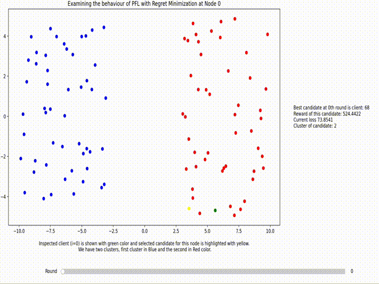

## Algorithm 1 PersFL via Regret Minimization

**Input:** local datasets $\mathcal{D}^{(i)}$ for $i = 1, \ldots, n$; learning rate $\alpha$, number $R$ of iterations, number $B$ of candidates.

1. **for** all nodes $i \in \mathcal{V}$ **do**
   - initialize $\mathbf{w}^{(i)} := 0$
   
2. **end for**

3. **for** $r = 0, 1, \ldots, R$ **do**
   
4. **for** all nodes $i \in \mathcal{V}$ in parallel **do**
   - randomly choose a candidate set $\mathcal{C}^{(i)} := \{i_1, \ldots, i_B \in \{1, \ldots, n\} \setminus \{i\}\}$
   
5. **for** each candidate $i' \in \mathcal{C}^{(i)}$ **compute reward**
   - $r_{i'}^{(i)} := L_i (\mathbf{\hat{w}}^{(i)}) - L_i \left( \mathbf{\hat{w}}^{(i)} - \alpha \nabla L_{i'} (\mathbf{\hat{w}}^{(i)}) \right)$

6. **end for**

7. **determine candidate $i_0' \in \mathcal{C}^{(i)}$ with largest reward**
   - $r_{i_0'}^{(i)} = \max_{i' \in \mathcal{C}^{(i)}} r_{i'}$

8. **do gradient step for local model parameters**
   - $\mathbf{\hat{w}}^{(i)} := \mathbf{\hat{w}}^{(i)} - \alpha \nabla L_{i_0'} (\mathbf{\hat{w}}^{(i)})$

9. **end for**

10. $r := r + 1$

11. **end for**

**Output:** local model parameters $\mathbf{\hat{w}}^{(i)}$ for each node $i = 1, \ldots, n$.

---

## Visualization How Algorithm Selects clients

In the animation below, we illustrate how the algorithm selects clients in high-dimensional linear settings where we have 100 clients, and each client has a dataset with a dimension size to the number of samples (d/m) equal to 15. Here, the candidate set size is equal to 20. For more details, refer to the animation directory.

